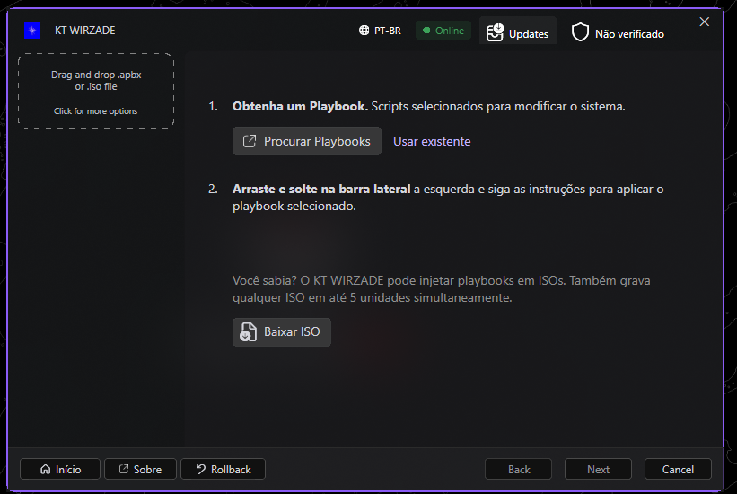

# KT WIRZADE

O **KT WIRZADE** é uma plataforma para criar, validar e executar playbooks de configuração do Windows. Ele transforma um pacote `.apbx` em uma experiência guiada: o usuário escolhe recursos na interface, acompanha a execução e pode consultar ou usar o rollback quando uma operação tiver backup.

O projeto é uma versão customizada e expandida do [AME Wizard](https://ameliorated.io), com identidade própria, interface em PT-BR/EN, motor compartilhado entre GUI e CLI e foco em automação reproduzível para instalações, otimizações e personalizações do Windows.

[](https://github.com/KT-TWEAKS/KT-WIRZADE/actions)
[](LICENSE)

> **Versão estável atual:** `1.0.1` · [Baixar EXE x64](https://github.com/KT-TWEAKS/KT-WIRZADE/releases/download/v1.0.1/KT-WIRZADE-v1.0.1-win-x64.exe) · [Release](https://github.com/KT-TWEAKS/KT-WIRZADE/releases/tag/v1.0.1) · [Playbooks](https://github.com/KT-TWEAKS/KT-TWEAKS-APBX)



*Painel real da versão 1.0.1: seleção de playbooks, status online, atualizações, idioma e acesso ao rollback.*

## O que ele faz

Um playbook pode declarar tarefas, opções, requisitos, imagens e metadados em YAML/XML. O KT WIRZADE:

1. carrega e valida o pacote `.apbx`;
2. apresenta páginas e opções para o usuário;
3. resolve as opções selecionadas e executa as ações na ordem definida;
4. mostra status e progresso da execução;
5. registra operações que podem ser revertidas;
6. executa etapas privilegiadas pela cadeia User → Administrator → TrustedInstaller.

Isso permite distribuir uma configuração complexa como um pacote versionado, em vez de depender de uma sequência manual de comandos.

## Principais recursos

| Área | O que está disponível |
|---|---|
| **Playbooks APBX** | Pacotes com `playbook.conf`, YAML de configuração, imagens e recursos auxiliares |
| **Interface gráfica** | Dashboard, páginas de opções, ações rápidas, status online/offline e suporte PT-BR/EN |
| **Execução privilegiada** | Fluxo multi-processo para executar ações que exigem Administrator ou TrustedInstaller |
| **Rollback** | Histórico por sessão, backups de arquivos, restauração de Registro/serviços quando possível e progresso visual |
| **Downloads** | Downloads atômicos, validação de tamanho, SHA-256 opcional e proteção de destino |
| **Atualizador** | Consulta releases oficiais do GitHub, mostra notas, baixa o EXE x64 e confere SHA-256 |
| **Modo ISO** | Download e preparação de imagens do Windows |
| **DevKit** | Edição, validação, preview e empacotamento de projetos de playbook |
| **CLI** | Execução automatizada sem depender da janela principal |

## Ações de playbook

O motor suporta ações para executar comandos e alterar o sistema, incluindo:

```text
!run              !cmd              !powershell
!file             !registryKey      !registryValue
!service          !scheduledTask    !appx
!systemPackage    !software         !download
!taskKill         !lineInFile       !regexFile
!shortcut         !user             !update
!task             !writeStatus
```

As ações são interpretadas pelo parser compartilhado. Tags legadas como `!regKey`, `!regValue` e `!powerShell` continuam reconhecidas para preservar compatibilidade com playbooks existentes.

## Rollback e limites

Cada execução cria uma sessão em `C:\ProgramData\AME\Rollbacks`. A interface mostra ações concluídas, pendentes e o percentual de progresso do rollback. O histórico é salvo com escrita atômica e pode ser retomado em execuções parciais.

Rollback não é uma máquina do tempo: apps/pacotes removidos, comandos arbitrários e operações sem backup não podem ser restaurados automaticamente. Antes de executar um playbook, leia suas tarefas e mantenha um backup do sistema para alterações importantes.

## Segurança e confiabilidade

- Includes são limitados ao diretório de configuração do playbook e rejeitam ciclos, caminhos externos, links de diretório e profundidade excessiva.
- Downloads validam origem, destino, tamanho e, quando informado, SHA-256; o atualizador aceita somente assets HTTPS do repositório oficial.
- A comunicação entre processos usa segredo aleatório, ACL de pipe e autenticação HMAC.
- Falhas de execução e comunicação são registradas como falha, não como sucesso silencioso.
- O projeto executa ações privilegiadas: somente use playbooks de origem confiável e revise o conteúdo antes de executá-los.
- SHA-256 verifica integridade do arquivo, mas não substitui uma assinatura Authenticode.

## Instalação e uso

### Usuário final

1. Baixe o [EXE final da release `v1.0.1`](https://github.com/KT-TWEAKS/KT-WIRZADE/releases/tag/v1.0.1).
2. Execute no Windows 10/11 x64 e aceite a elevação quando necessário.
3. Importe ou selecione um playbook `.apbx`.
4. Revise as opções e os requisitos antes de iniciar.
5. Acompanhe a execução e consulte o painel de rollback se precisar reverter operações compatíveis.

Usuários da versão `1.0.0` devem fazer essa primeira atualização manualmente. A partir da `1.0.1`, o verificador de updates identifica versões antigas e oferece o download direto do EXE oficial.

### Desenvolvedor de playbooks

Um pacote mínimo segue esta estrutura:

```text
meu-playbook.apbx
├── playbook.conf
├── playbook.png              # opcional
└── Configuration/
    ├── main.yml
    └── outras-tarefas.yml
```

O repositório de playbooks da organização está em [KT-TWEAKS-APBX](https://github.com/KT-TWEAKS/KT-TWEAKS-APBX). Para criar pacotes, use o DevKit ou siga os exemplos e valide o YAML antes de distribuir.

### Como funciona a verificação

Ao importar um `.apbx`, o aplicativo calcula o SHA-256 do arquivo local e consulta o registro oficial em `licensing-site.vercel.app/api/verify`. A consulta usa o `ProductCode` quando existe e também envia o hash; playbooks sem `ProductCode` são resolvidos pelo hash. O fluxo é:

```text
APBX local
  -> SHA-256
  -> /api/verify?prodID=...&hash=...
  -> verified | malicious | unverified | unknown
  -> selo e bloqueios da interface
```

`verified` significa que o hash ou código está registrado e auditado no catálogo oficial. `malicious` bloqueia o playbook. `unverified` e `unknown` permitem análise/uso conforme as regras da interface, mas não recebem selo de confiança. Se a API estiver indisponível, o status fica `unreached` e o aplicativo não inventa uma aprovação.

Para um APBX aparecer como oficial, o arquivo distribuído deve ser exatamente o asset registrado: qualquer reempacotamento altera o SHA-256 e exige atualizar o registro. O catálogo público e os links de download ficam no repositório [KT-TWEAKS-APBX](https://github.com/KT-TWEAKS/KT-TWEAKS-APBX); a API é a fonte do status, não apenas o nome do arquivo ou o autor declarado no manifesto.

## Arquitetura do código

```text
KT-Wirzade.sln
├── KTWirzade.GUI/          # WPF, Dashboard, diálogos e DevKit
├── KTWirzade.Shared/       # Parser, ações, downloads, updates e rollback
├── KTWirzade.CLI/          # Entrada para automação
├── Core/                   # Logging, Win32, processos e serialização
└── Interprocess/           # Comunicação User → Admin → TrustedInstaller
```

| Projeto | Tecnologia | Responsabilidade |
|---|---|---|
| `KTWirzade.GUI` | WPF / .NET Framework 4.8 | Interface principal e experiência do usuário |
| `KTWirzade.Shared` | .NET Framework 4.7.2 | Motor de playbooks e serviços compartilhados |
| `KTWirzade.CLI` | .NET Framework 4.7.2 | Execução por linha de comando |
| `Core` | Shared/Win32 | Infraestrutura de baixo nível e logging |
| `Interprocess` | IPC Windows | Elevação e comunicação entre níveis |

## Build local

O build oficial é executado no Windows:

```powershell
.\scripts\build-release.ps1
```

Requisitos:

- Windows 10/11 x64;
- Visual Studio Build Tools com MSBuild;
- Developer Pack do .NET Framework 4.7.2 e 4.8;
- acesso ao NuGet.

O script restaura dependências, compila Shared/CLI/GUI, verifica recursos incorporados e gera:

```text
artifacts/
├── KT-WIRZADE-v1.0.1-win-x64.exe
├── KT-WIRZADE-v1.0.1-manifest.json
└── SHA256SUMS.txt
```

A validação do hotfix `1.0.1` foi concluída em Windows sem erros de build. Permanecem apenas warnings legados de referências e nullable.

## Hotfix 1.0.1

O hotfix concentra correções de estabilidade no motor, proteção de downloads, recuperação/rollback, atualização automática e layout da interface. Entre elas estão a barra de progresso do rollback, correções de parsing e quoting, validação contra path traversal, download direto do EXE com progresso e SHA-256, além da correção de dois erros de compilação da GUI.

Veja o changelog completo em [RELEASE-1.0.1.md](RELEASE-1.0.1.md) e o histórico em [CHANGELOG.md](CHANGELOG.md).

## Licença e autoria

MIT — veja [LICENSE](LICENSE).

**Autor:** [kelvenapk](https://github.com/kelvenapk) · **Organização:** [KT-TWEAKS](https://github.com/KT-TWEAKS)

## Organização dos repositórios

Este repositório público mantém somente a source estável, os arquivos necessários
para compilação/release e a documentação voltada ao usuário final. Suítes de
regressão, diagnósticos, relatórios de auditoria e materiais de desenvolvimento
ficam fora deste repositório público.
