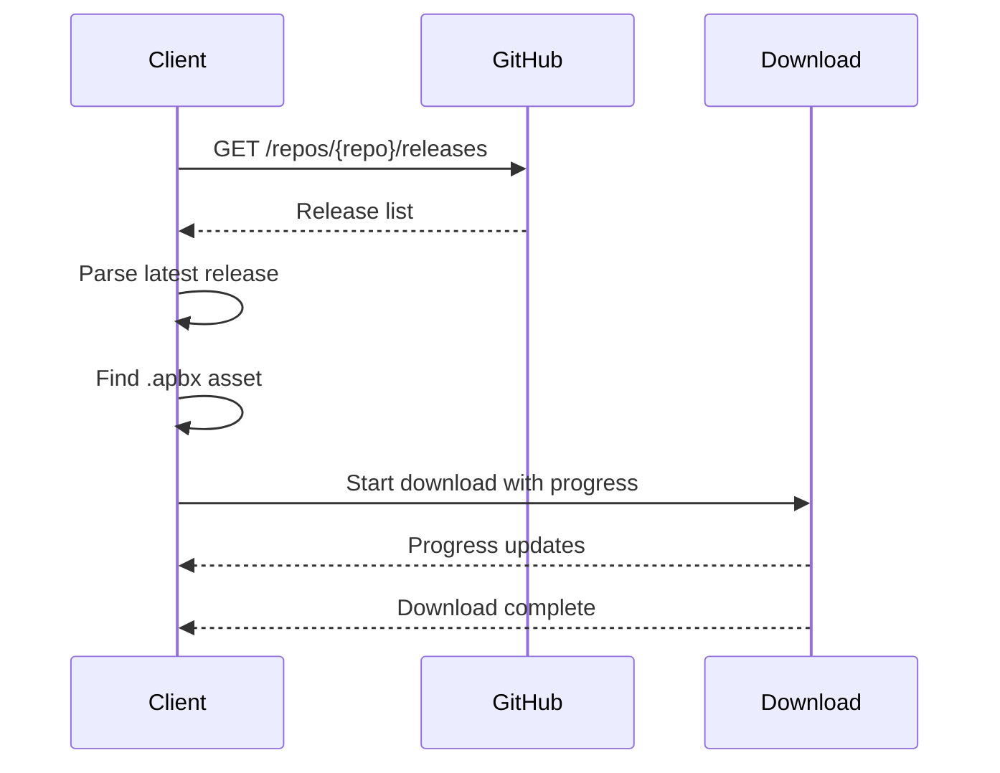

# Update API

The update system checks for new playbook versions via Git platform APIs.

## Supported Platforms

| Platform | API Base URL |
|----------|--------------|
| GitHub | `https://api.github.com` |
| GitLab | `https://gitlab.com/api/v4` |
| Gitea | `https://{host}/api/v1` |

## Endpoints

### List Releases

| Platform | Endpoint |
|----------|----------|
| GitHub | `GET /repos/{owner}/{repo}/releases` |
| GitLab | `GET /projects/{id}/releases` |
| Gitea | `GET /repos/{owner}/{repo}/releases` |

### Get Latest Version

```csharp
string url = gitPlatform switch
{
    "github.com" => $"https://api.github.com/repos/{repo}/releases",
    "gitlab.com" => $"https://gitlab.com/api/v4/projects/{Uri.EscapeDataString(repo)}/releases",
    _ => $"https://{gitPlatform}/api/v1/repos/{repo}/releases"
};
```

## Response Parsing

### GitHub Response

```json
[
  {
    "tag_name": "v1.0.0",
    "assets": [
      {
        "name": "playbook.apbx",
        "browser_download_url": "https://...",
        "size": 3000000
      }
    ]
  }
]
```

### GitLab Response

```json
[
  {
    "tag_name": "v1.0.0",
    "assets": {
      "links": [
        {
          "name": "playbook.apbx",
          "direct_asset_url": "https://...",
          "size": 3000000
        }
      ]
    }
  }
]
```

## Client Methods

### Get Latest Version

```csharp
public async Task<string> LatestPlaybookVersion()
{
    var url = $"https://api.github.com/repos/{repo}/releases";
    var response = await httpClient.GetAsync(url);
    var json = await response.Content.ReadAsStringAsync();
    var array = JArray.Parse(json);
    var tag = (string)array.FirstOrDefault()?["tag_name"];
    return tag?.TrimStart('v');
}
```

### Get All Versions

```csharp
public async Task<List<string>> GetPlaybookVersions()
{
    // Returns list of all version tags
}
```

### Download Latest

```csharp
public async Task DownloadLatestPlaybook(BackgroundWorker worker)
{
    // Downloads latest .apbx from releases
    // Reports progress via BackgroundWorker
}
```

## Download Flow



## User Agent

All requests use:
```csharp
httpClient.DefaultRequestHeaders.UserAgent.ParseAdd("curl/7.55.1");
```

Required for GitHub API access.

## Error Handling

| Error | Behavior |
|-------|----------|
| Network error | Throw exception |
| Invalid JSON | Throw exception |
| No releases | Return null |
| No .apbx asset | Skip download |

---

> [!info] See Also
> - [[API/Verification-API]] - Verification API
> - [[Playbooks/Playbook-Conf]] - Git property configuration
