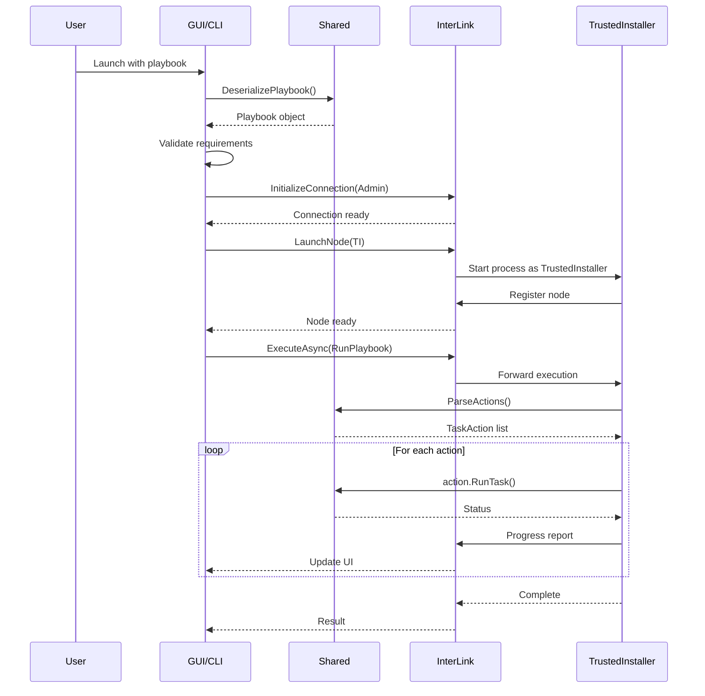

# Execution Flow

The complete pipeline from playbook loading to action execution.

## Sequence Diagram



## Step-by-Step Flow

### 1. Playbook Loading

```
AmeliorationUtil.DeserializePlaybook(path)
  ├── Read playbook.conf (XML)
  ├── Deserialize to Playbook object
  ├── Validate schema
  └── Set Playbook.Path
```

### 2. Configuration Extraction

```
ExtractResourceFolder("resources", dir)
  ├── 7za.exe (7-Zip standalone)
  ├── CLI-Resources.7z → ame-assassin/
  └── ProcessInformer.7z (optional)
```

### 3. Connection Initialization

```
InterLink.InitializeConnection(Level.Administrator, Mode.TwoWay)
  ├── Create named pipe server
  ├── Register current level
  └── Wait for node connections
```

### 4. Privilege Escalation

```
InterLink.LaunchNode(TI)
  ├── NativeProcess.StartProcessAsTI()
  │   └── Uses NSudoLC.exe for TI launch
  ├── New process connects via named pipe
  └── Register TI node in LevelController
```

### 5. Action Parsing

```
AmeliorationUtil.ParseActions(configPath, options)
  ├── Read YAML files from Configuration/
  ├── PlaybookParser.Deserializer.Deserialize<UninstallTask>()
  ├── Evaluate conditions (option, builds, iso, oobe)
  ├── Resolve !task includes
  └── Return List<ITaskAction>
```

### 6. Action Execution

```
foreach action in actions:
  ├── Check conditions (option, builds, arch, iso, oobe)
  ├── action.RunTask(output)
  │   ├── GetStatus() → ToDo/InProgress/Completed
  │   ├── Execute operation
  │   └── Return status
  └── Report progress via InterLink
```

### 7. Completion

```
InterLink.ExecuteAsync → returns bool (errorsOccurred)
  ├── If errors: "Playbook completed with errors"
  └── If success: "Playbook completed successfully"
```

## Progress Reporting

Progress is reported through the `InterLink.InterProgress` callback:

```csharp
new InterLink.InterProgress(value => {
    Console.WriteLine(value + "% " + status + "...");
})
```

Progress weight is calculated from action counts:
```csharp
AmeliorationUtil.GetProgressMaximum(actions)
  => actions.Sum(action => action.GetProgressWeight())
```

## Error Handling

| Error Level | Behavior |
|-------------|----------|
| `ErrorAction.Ignore` | Continue execution |
| `ErrorAction.Log` | Log and continue |
| `ErrorAction.Notify` | Show notification, continue |
| `ErrorAction.Halt` | Stop execution |

---

> [!info] See Also
> - [[Architecture/Interprocess]] - InterLink details
> - [[Shared/Actions]] - Action implementations
> - [[Shared/Tasks]] - Task structures
