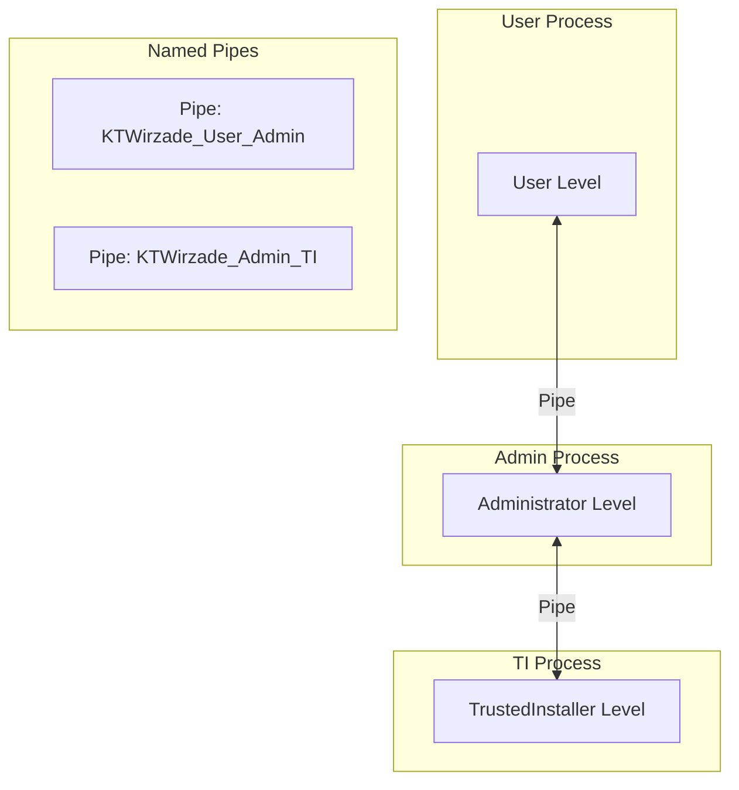
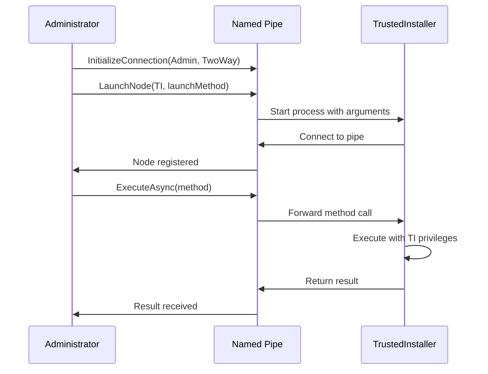

# Interprocess Communication

The InterLink system manages communication between processes at different privilege levels.

## Architecture



## Levels

```csharp
public enum Level
{
    Any,
    Disposable,
    User,
    Administrator,
    TrustedInstaller,
}
```

| Level | Description | Typical Use |
|-------|-------------|-------------|
| `User` | Standard user | Windows Update checks |
| `Administrator` | Elevated admin | CLI/GUI main process |
| `TrustedInstaller` | System-level | File/registry modifications |
| `Disposable` | Short-lived | One-off tasks |

## Connection Modes

```csharp
public enum Mode
{
    SendOnly,     // One-way communication
    ReceiveOnly,  // Listen only
    TwoWay        // Bidirectional (default)
}
```

## Named Pipe Protocol

- **Prefix**: `KTWirzade`
- **Max Message Size**: 100MB
- **Serialization**: JSON (`System.Text.Json`)
- **Security**: Windows ACL on pipe handles

### Pipe Naming Convention

```
KTWirzade_{SourceLevel}_{TargetLevel}
```

## Launching a Node

```csharp
InterLink.LaunchNode(
    parentLevel: TargetLevel.Administrator,
    launchMethod: () => NativeProcess.StartProcessAsTI(...),
    level: Level.TrustedInstaller,
    mode: Mode.TwoWay,
    hostPid: Process.GetCurrentProcess().Id,
    allowAutoRelaunch: false
);
```

## Execution Flow



## Node Lifecycle

1. **Registration**: Node connects and registers via `LevelController.Register()`
2. **Monitoring**: Host PID monitored for unexpected exits
3. **Communication**: Methods invoked via pipe messages
4. **Shutdown**: `InterLink.ShutdownNode(level)` terminates a specific node

## Error Recovery

- **Auto-relaunch**: If `allowAutoRelaunch` is true and node exits unexpectedly, it will be restarted
- **Timeout**: 30-second timeout on node launch
- **Cancellation**: Pending operations cancelled on node exit

## Security Considerations

> [!warning] Pipe Security
> Named pipes use Windows security descriptors. Only processes with appropriate access can connect to the pipe.

> [!info] TrustedInstaller Launch
> The `NativeProcess.StartProcessAsTI()` method uses `NSudoLC.exe` with `-U:T` flag to launch processes as TrustedInstaller.

---

> [!info] See Also
> - [[Architecture/Overview]] - System overview
> - [[Architecture/Execution-Flow]] - Complete execution pipeline
