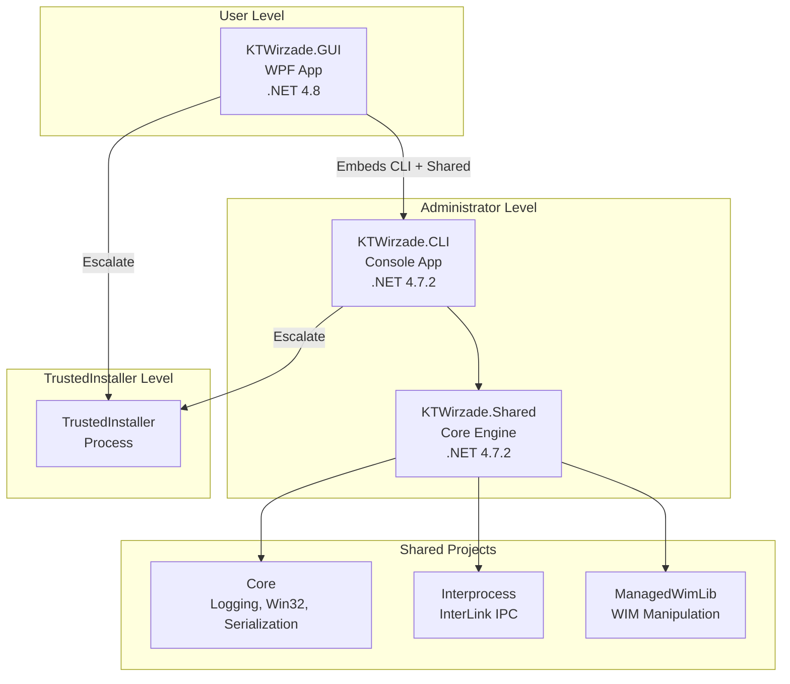
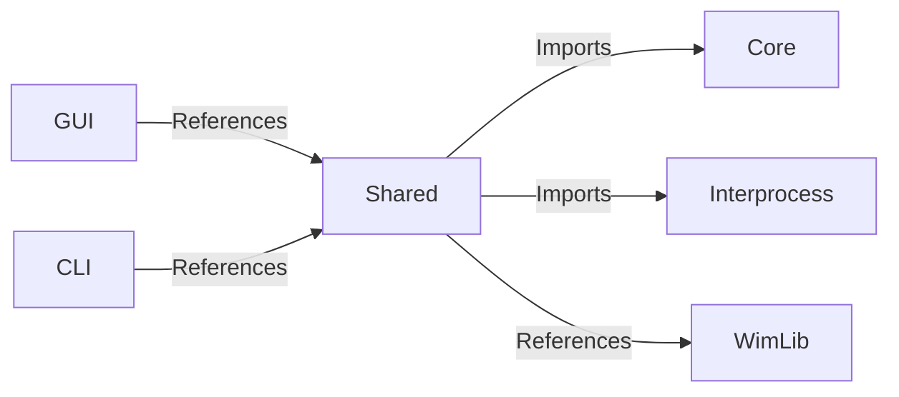

# Architecture Overview

KT WIRZADE is a multi-project .NET solution that executes playbook-based Windows modifications with escalating privilege levels.

## System Diagram

## Privilege Levels

The system operates across three Windows privilege levels:

| Level | Process | Description |
|-------|---------|-------------|
| **User** | GUI | Standard user interaction |
| **Administrator** | CLI / GUI | Elevated operations |
| **TrustedInstaller** | Spawned Process | System-level modifications |

> [!warning] Privilege Escalation
> Actions that modify system files, registry hives, or services require TrustedInstaller privileges. The [[Architecture/Interprocess|InterLink]] system handles escalation automatically.

## Core Flow

1. **User** launches GUI or CLI
2. **Administrator** process validates playbook and requirements
3. **InterLink** spawns TrustedInstaller process
4. **TrustedInstaller** executes all system modifications
5. Results flow back through InterLink to the user interface

## Project Relationships

## Key Design Decisions

- **Shared Project pattern** for Core and Interprocess (compiled into each consuming project)
- **.NET Framework 4.7.2** for CLI/Shared (broad compatibility)
- **.NET Framework 4.8** for GUI (WPF support)
- **Named Pipes** for interprocess communication
- **YamlDotNet** for playbook parsing

---

> [!info] See Also
> - [[Architecture/Projects]] - Detailed project descriptions
> - [[Architecture/Execution-Flow]] - Complete execution pipeline
> - [[Architecture/Interprocess]] - InterLink communication details
