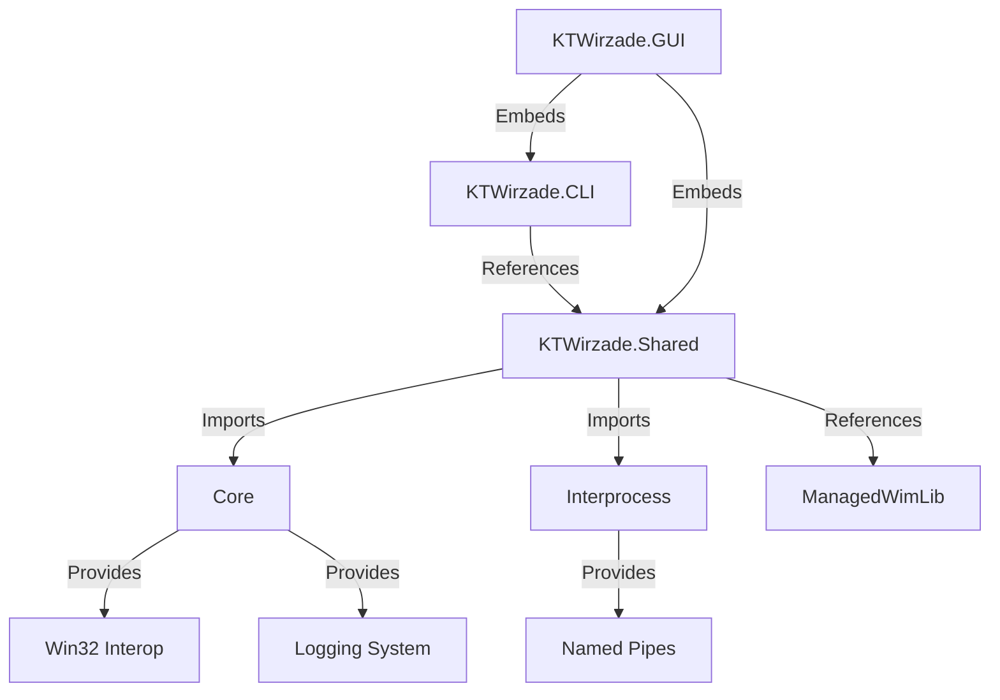

# Projects

The KT-Wirzade solution contains 6 projects, each with a specific role.

## Solution Structure

```
KT-Wirzade.sln
├── KTWirzade.CLI/          # Command-line interface
├── KTWirzade.Shared/       # Core engine library
├── KTWirzade.GUI/          # WPF graphical interface
├── Core/                   # Low-level infrastructure (Shared Project)
├── Interprocess/           # Inter-process communication (Shared Project)
└── ManagedWimLib/          # WIM file manipulation
```

## Project Details

### KTWirzade.CLI

| Property | Value |
|----------|-------|
| Type | Console Application |
| Target Framework | .NET Framework 4.7.2 |
| Platform | x64 |
| Entry Point | `CLI.cs` → `Main()` |

The CLI is the primary execution engine. It accepts a playbook directory as a command-line argument, validates requirements, escalates to TrustedInstaller, and executes all actions.

**Key Files:**
- `CLI.cs` - Main entry point, playbook execution logic
- `CommandLine.cs` - Argument parsing framework

### KTWirzade.Shared

| Property | Value |
|----------|-------|
| Type | Class Library |
| Target Framework | .NET Framework 4.7.2 |
| Platform | x64 |
| Imports | Core, Interprocess |

The shared library contains the playbook parser, all action implementations, task execution logic, USB/ISO handling, and verification system.

**Key Namespaces:**
- `KTWirzade.Shared.Actions` - All 20+ action types
- `KTWirzade.Shared.Parser` - YAML/XML parsing
- `KTWirzade.Shared.Tasks` - Task execution framework
- `KTWirzade.Shared.USB` - USB/ISO operations

### KTWirzade.GUI

| Property | Value |
|----------|-------|
| Type | WPF Application |
| Target Framework | .NET Framework 4.8 |
| Platform | x64 |
| UI Framework | WPF with MVVM |

The GUI provides an interactive wizard interface with page-based navigation, theme support (Windows 10/11, Dark/Light), and drag-and-drop playbook import.

**Key Directories:**
- `Views/` - Page views (XAML)
- `Pages/` - Page components
- `Controls/` - Custom controls
- `Themes/` - Windows 10/11 theme resources
- `Windows/` - Dialog windows

### Core (Shared Project)

Low-level infrastructure compiled into each consuming project. Provides:
- Win32 API interop
- Logging system
- Serialization utilities
- Process management

### Interprocess (Shared Project)

Inter-process communication framework. Provides:
- Named pipe communication
- Privilege level management
- Message serialization
- Node lifecycle management

### ManagedWimLib

WIM file manipulation library for ISO operations. Used when injecting playbooks into Windows installation media.

## Dependencies



## NuGet Dependencies

### KTWirzade.Shared
- `YamlDotNet` - YAML parsing
- `Newtonsoft.Json` - JSON serialization
- `SharpSevenZip` - 7-Zip archive handling
- `Microsoft.Wim` - WIM file operations
- `Polly.Core` - Resilience patterns
- `Downloader` - File download management
- `TaskScheduler` - Windows Task Scheduler integration

### KTWirzade.GUI
- `FluentIcons.Wpf` - Fluent Design icons
- `Microsoft.Toolkit.Uwp.Notifications` - Toast notifications
- `WmiLight` - WMI query helpers
- `DiscUtils.*` - ISO/UDF/WIM manipulation

---

> [!info] See Also
> - [[Architecture/Overview]] - System overview
> - [[Deployment/Build]] - Build instructions
