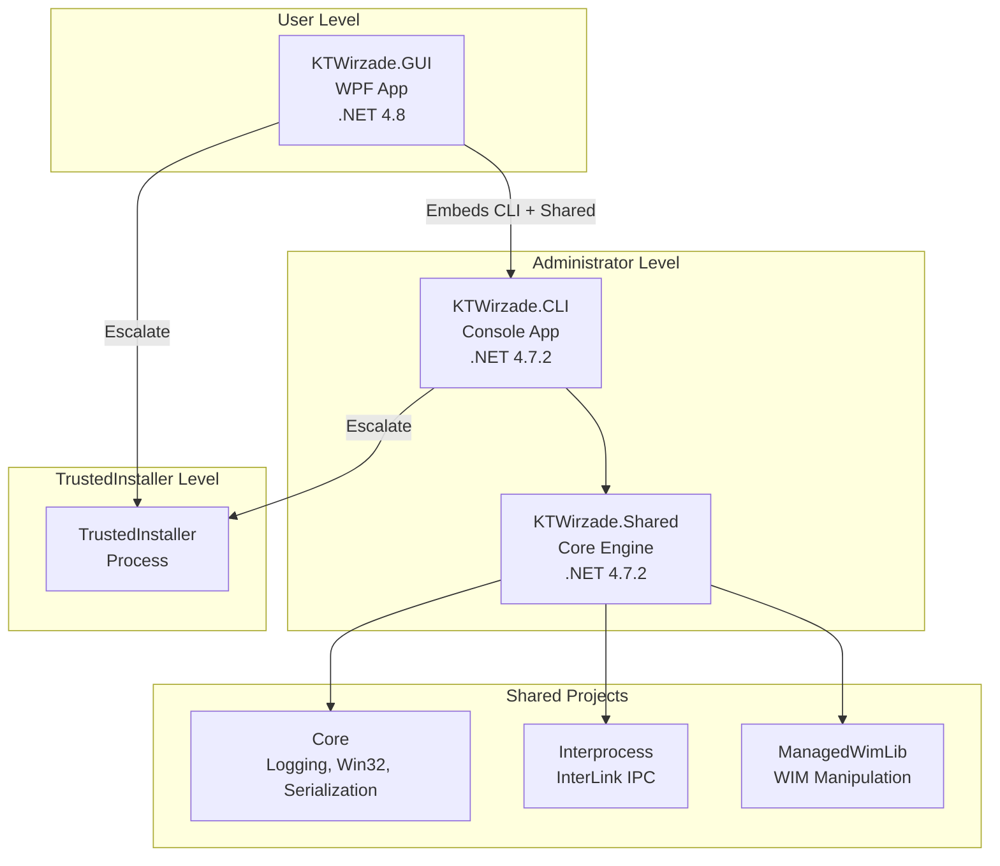
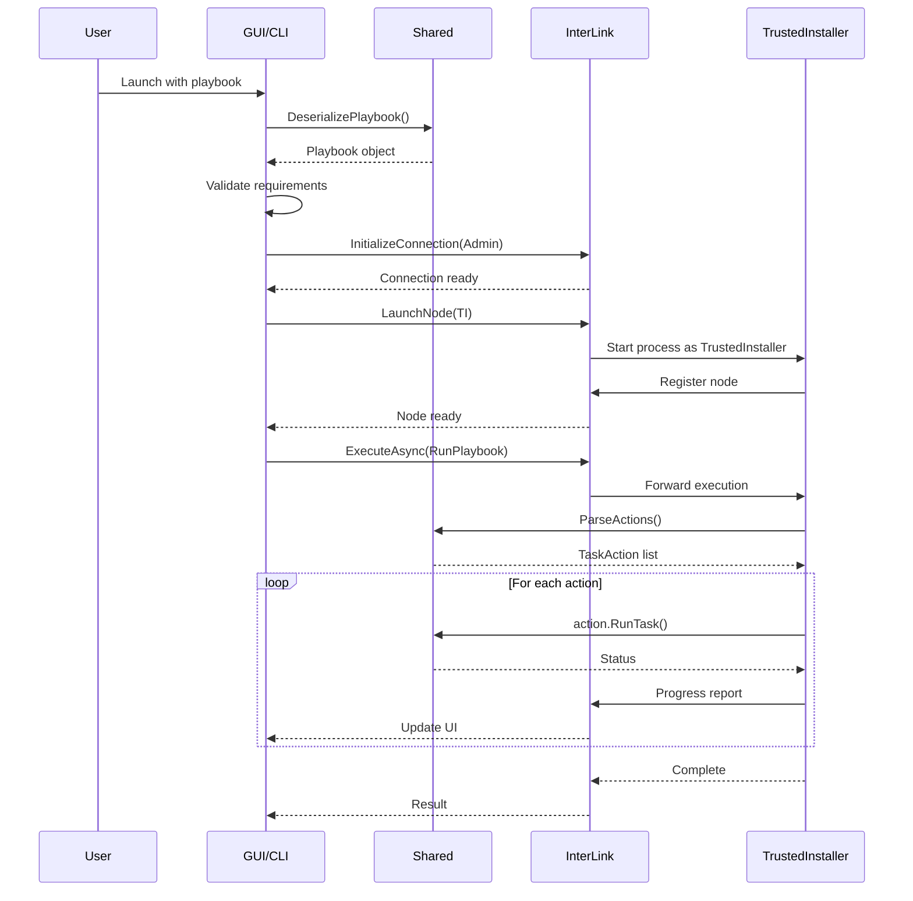
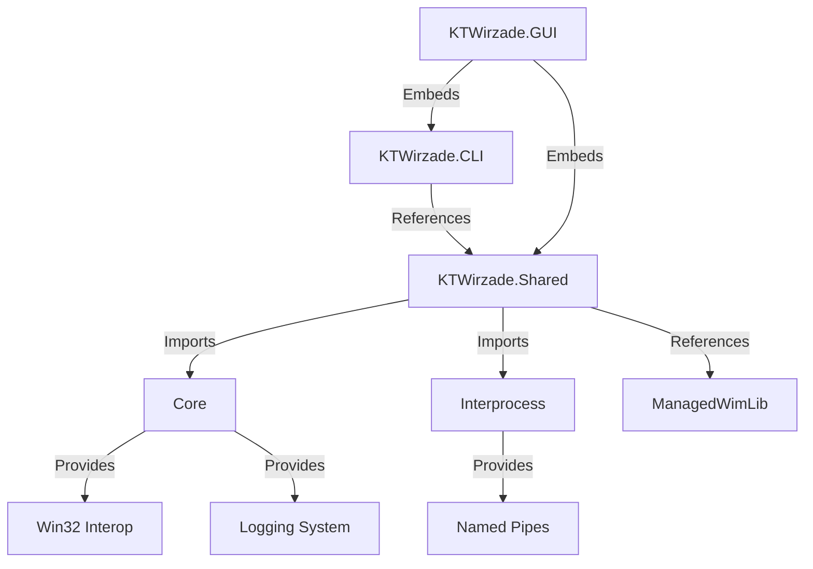
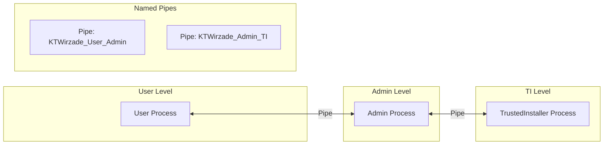
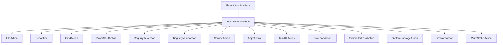
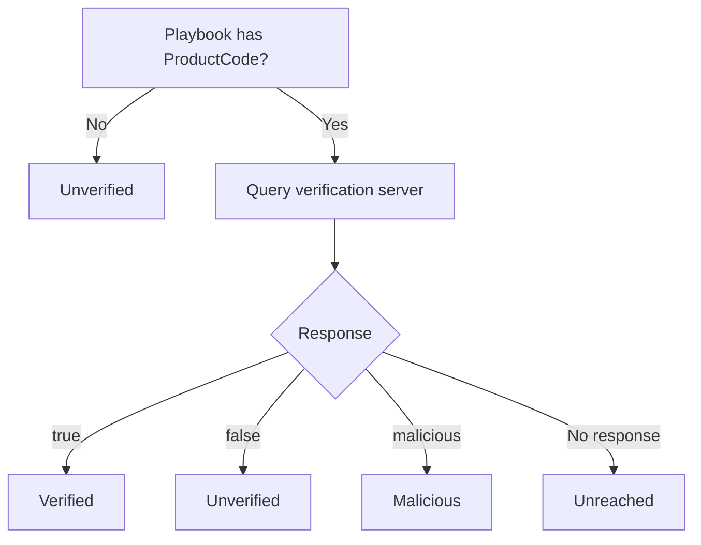
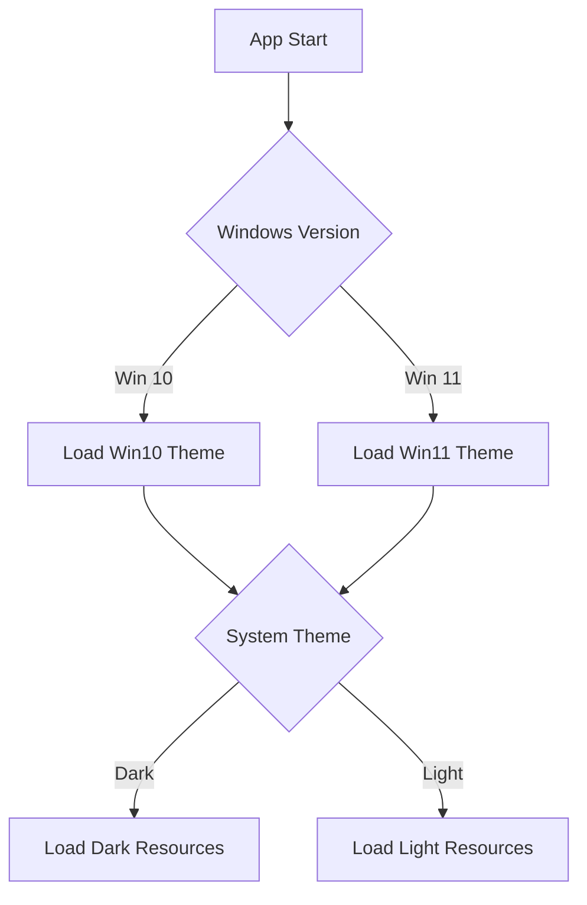
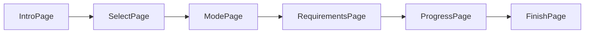
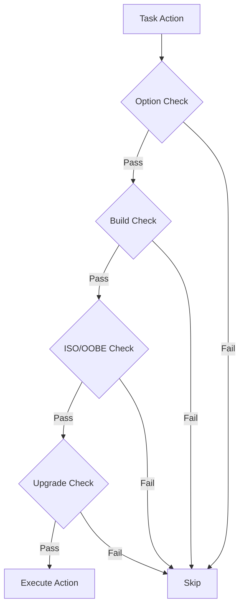
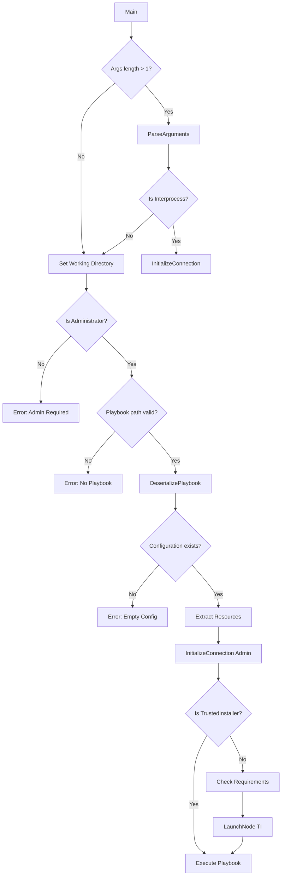

# Diagrams

All Mermaid diagrams used across the documentation.

## System Architecture

## Execution Flow Sequence

## Project Dependencies

## Privilege Escalation

## Action Class Hierarchy

## Verification Flow

## Theme Detection

## GUI Page Flow

## Task Condition Evaluation

## CLI Execution Flow

---

> [!info] See Also
> - [[Architecture/Overview]] - System overview
> - [[Architecture/Execution-Flow]] - Execution pipeline
