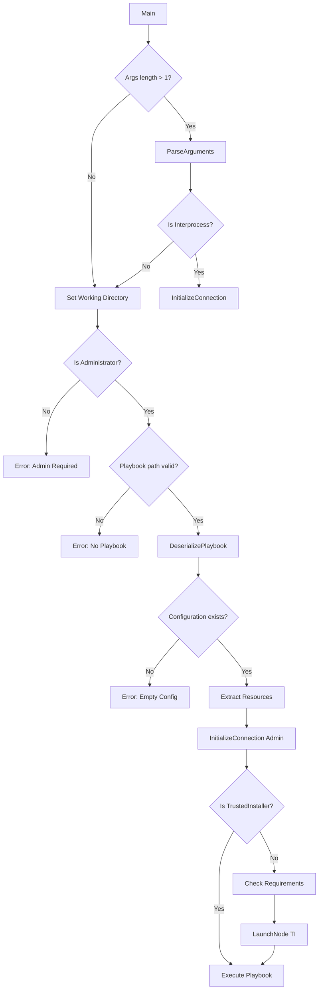

# CLI Overview

KTWirzade.CLI is the command-line execution engine.

## Entry Point

```csharp
// CLI.cs
private static async Task<int> Main(string[] args)
```

## Command Line Arguments

### Basic Usage

```cmd
KTWirzade.CLI.exe "path\to\playbook"
```

### Interprocess Mode

```cmd
KTWirzade.CLI.exe "directory" Interprocess Administrator --Mode TwoWay --Nodes Level=User:ProcessID=1234
```

## Argument Types

### Playbook Execution

| Argument | Required | Description |
|----------|----------|-------------|
| `args[0]` | Yes | Path to playbook directory |

### Interprocess Arguments

| Argument | Required | Description |
|----------|----------|-------------|
| `Interprocess` | Yes | Mode identifier |
| `Level` | Yes | Target privilege level |
| `--Mode` | Yes | Communication mode |
| `--Nodes` | No | Connected nodes |
| `--Host` | No | Host PID to monitor |

## Execution Flow



## Output

The CLI writes to stdout:
- Progress percentages: `50% Disabling services...`
- Status messages: `Starting Playbook...`
- Completion: `Playbook completed successfully.`
- Errors: `Playbook completed with errors.`

## Error Codes

| Code | Description |
|------|-------------|
| `0` | Success |
| `-1` | General error |
| `1` | Initialization error |
| `376` | Interprocess connection |

## Embedded Resources

The CLI embeds these resources:
- `7za.exe` - 7-Zip standalone
- `7za.dll` / `7zxa.dll` - 7-Zip libraries
- `CLI-Resources.7z` - Additional tools
- `ProcessInformer.7z` - Process analysis tool
- `Z-AME-NoDefender-*.cab` - Defender packages

## Requirements

- Must run as Administrator
- .NET Framework 4.7.2
- Windows 10 19041+

---

> [!info] See Also
> - [[CLI/Usage]] - Usage examples
> - [[Architecture/Execution-Flow]] - Execution pipeline
