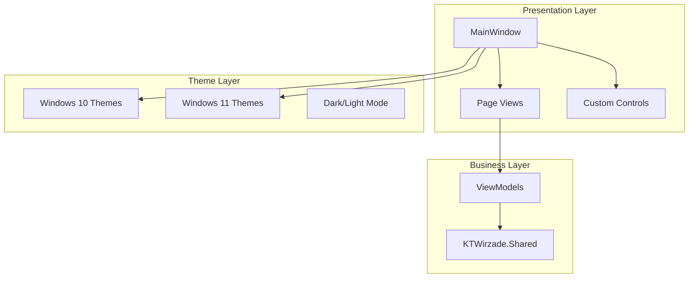

# GUI Overview

KTWirzade.GUI is a WPF application providing an interactive wizard interface.

## Architecture



## MVVM Pattern

The GUI uses a lightweight MVVM approach:
- **Views** (`.xaml`) define UI layout
- **Code-behind** handles view-specific logic
- **Shared library** provides business logic

## Page Navigation

The wizard follows a linear page flow:


### Page List

| Page | Purpose |
|------|---------|
| `IntroPage` | Welcome and playbook info |
| `SelectPage` | Playbook selection/import |
| `ModePage` | Feature option selection |
| `RequirementsPage` | System requirement checks |
| `ProgressPage` | Execution progress |
| `FinishPage` | Completion status |
| `FinishErrorPage` | Error completion |

### ISO Mode Pages

| Page | Purpose |
|------|---------|
| `IsoModePage` | ISO operation mode |
| `IsoPage` | ISO file selection |
| `IsoOptionsPage` | ISO-specific options |
| `IsoRequirementsPage` | ISO requirements |
| `IsoLicensePage` | License agreement |

## Key Components

- `MainWindow` - Primary application window
- `Page Views` - Individual wizard pages
- `Controls` - Reusable UI components
- `Windows` - Modal dialogs

## Entry Point

```csharp
// App.xaml.cs
protected override void OnStartup(StartupEventArgs e)
{
    // Theme detection
    // Page initialization
    // MainWindow.Show()
}
```

## Platform Requirements

| Requirement | Value |
|-------------|-------|
| OS | Windows 10 19041+ |
| Framework | .NET Framework 4.8 |
| Platform | x64 |
| UI | WPF |

## Runtime Dependencies

The GUI embeds `KTWirzade.Shared.dll` as a DLL reference, but several dependencies must be in the output directory:

### Shared Library Dependencies

| File | Source | Purpose |
|------|--------|---------|
| `KTWirzade.Shared.dll` | Build output (embedded in Resources) | Core engine |
| `YamlDotNet.dll` | NuGet package | YAML parsing for playbook tasks |
| `TimeZoneConverter.dll` | NuGet package | Timezone conversions |
| `JetBrains.Annotations.dll` | NuGet package | Code annotations |

### Native DLLs

| File | Source | Purpose |
|------|--------|---------|
| `7z.dll` | Shared build output | Archive extraction (playbook `.apbx` files) |
| `client-helper.dll` | `Core\Helper\x64\Release\` | Native helper for privilege escalation |

### Common Crash: Missing Dependencies

If the GUI crashes on startup with `FileNotFoundException` or `TypeInitializationException`:
1. Ensure all Shared dependencies are copied to the GUI output directory
2. Use `build.bat` which handles all copies automatically
3. Check that `7z.dll` is in the same folder as `KTWirzade.GUI.exe` (not in `%TEMP%`)

## Known Bugs Fixed

| Bug | Fix |
|-----|-----|
| `7z.dll` path resolution | `App.xaml.cs:202` uses `Assembly.GetExecutingAssembly().Location` instead of `CurrentDirectory` |
| `Log` static constructor crash | Missing YamlDotNet.dll in output directory (copied by `build.bat`) |
| "Playbook failed" on apply | `ProgressDialog.xaml.cs:186` had swapped `TargetLevel`/`Level` parameters in `LaunchNode` |

---

> [!info] See Also
> - [[GUI/Pages]] - Detailed page documentation
> - [[GUI/Controls]] - Custom controls
> - [[GUI/Themes]] - Theme system
