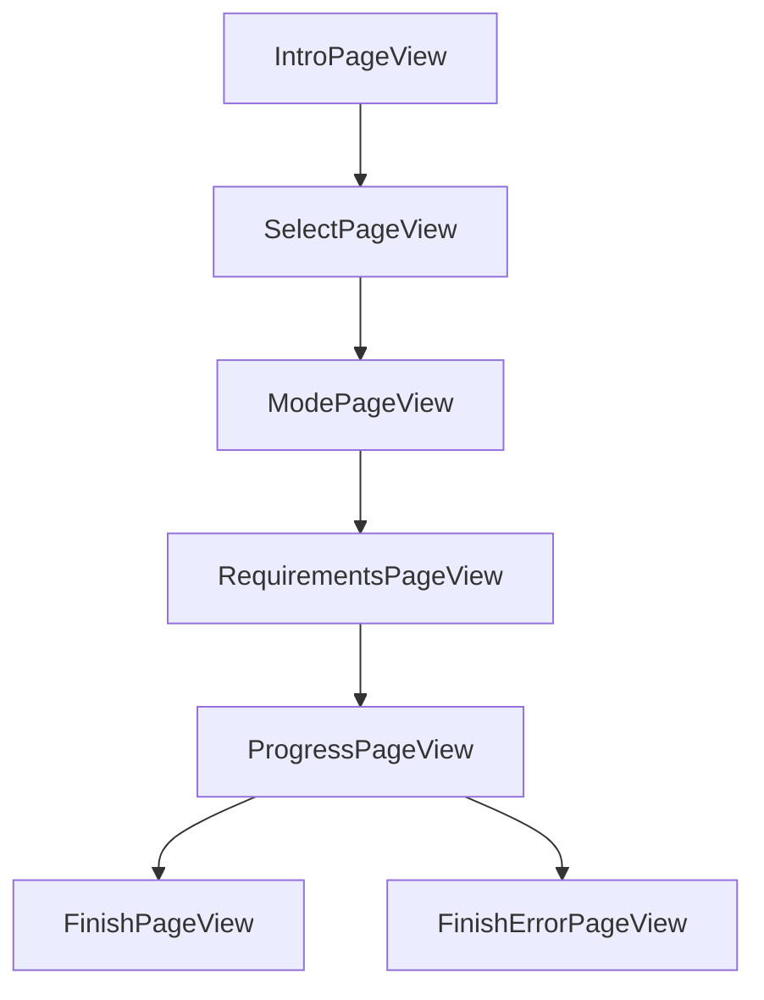

# GUI Pages

All pages in the wizard interface.

## Page Flow

## Standard Pages

### IntroPageView
- **Purpose**: Welcome screen with playbook information
- **Displays**: Playbook name, author, version, description
- **Actions**: Next button

### SelectPageView
- **Purpose**: Playbook selection or import
- **Features**:
  - Drag-and-drop `.apbx` import
  - Playbook list from `%PROGRAMDATA%\KTWirzade\Playbooks\`
  - Verification status display
- **Sub-components**:
  - `SelectISOPage` - ISO file selection
  - `SelectISOPane` - ISO options pane

### ModePageView
- **Purpose**: Feature option selection
- **Features**:
  - Dynamic page generation from `FeaturePages`
  - CheckboxPage, RadioPage, RadioImagePage support
  - Conditional display based on dependencies
- **Sub-components**:
  - `FeaturePage` - Individual feature page
  - `FeaturesPane` - Feature container
  - `RadioImageButton` - Image selection button

### RequirementsPageView
- **Purpose**: System requirement validation
- **Checks**:
  - Windows Defender status
  - Internet connectivity
  - Battery status
  - UCPD driver status
  - Pending updates

### ProgressPageView
- **Purpose**: Execution progress display
- **Features**:
  - Real-time progress bar
  - Status text updates
  - Error log display

### FinishPageView
- **Purpose**: Successful completion
- **Actions**: Close, View logs

### FinishErrorPageView
- **Purpose**: Error completion
- **Displays**: Error details, log location

## ISO Mode Pages

### IsoModePageView
- **Purpose**: ISO operation mode selection
- **Options**: Create bootable USB, Modify existing ISO

### IsoPageView
- **Purpose**: ISO file and USB drive selection
- **Features**:
  - ISO file browser
  - USB drive detection
  - `RadioPlaybookButton` - Playbook selection for ISO

### IsoOptionsPageView
- **Purpose**: ISO-specific configuration
- **Features**:
  - `IsoOptionsPane` - Options container
  - `IsoOptionPage` - Individual option page

### IsoRequirementsPageView
- **Purpose**: ISO-specific requirement checks

### IsoLicensePageView
- **Purpose**: License agreement for ISO operations

## Dialog Windows

| Dialog | Purpose |
|--------|---------|
| `ProgressDialog` | Execution progress |
| `PrepareDialog` | System preparation |
| `SecurityDialog` | Security warnings |
| `AntivirusDialog` | Antivirus detection |
| `UpdatesDialog` | Update management |
| `TweaksDialog` | Tweak options |
| `UsbWriteDialog` | USB write progress |
| `IsoProgressDialog` | ISO progress |
| `ApplyPackageDialog` | Package installation |
| `AboutWindow` | About information |
| `UACBox` | UAC prompt |

---

> [!info] See Also
> - [[GUI/Controls]] - Custom controls
> - [[GUI/Themes]] - Theme system
