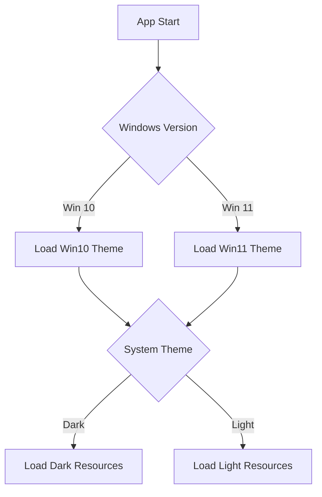

# Themes

The GUI supports Windows 10 and Windows 11 visual styles with dark and light modes.

## Theme Structure

```
Themes/
├── StaticStyles.xaml
├── Windows10/
│   ├── SharedStyles.xaml
│   ├── DarkStyles.xaml
│   ├── DarkResources.xaml
│   ├── LightStyles.xaml
│   └── LightResources.xaml
└── Windows11/
    ├── SharedStyles.xaml
    ├── DarkStyles.xaml
    ├── DarkResources.xaml
    ├── LightStyles.xaml
    └── LightResources.xaml
```

## Theme Detection



## Windows Version Detection

The GUI detects Windows version via registry:

```
HKLM\SOFTWARE\Microsoft\Windows NT\CurrentVersion
  CurrentBuildNumber → 22000+ = Windows 11
```

## Dark Mode

### Dark Resource Colors

| Resource | Color |
|----------|-------|
| Background | `#202020` |
| Surface | `#2D2D2D` |
| Card | `#353535` |
| Text Primary | `#FFFFFF` |
| Text Secondary | `#B0B0B0` |
| Accent | `#0078D4` |

### Dark Icon Set

All icons have dark mode variants in `Icons/dark/`:
- Lighter colors for dark backgrounds
- Higher contrast for visibility

## Light Mode

### Light Resource Colors

| Resource | Color |
|----------|-------|
| Background | `#F3F3F3` |
| Surface | `#FFFFFF` |
| Card | `#FFFFFF` |
| Text Primary | `#1A1A1A` |
| Text Secondary | `#666666` |
| Accent | `#0078D4` |

### Light Icon Set

Icons in `Icons/light/`:
- Darker colors for light backgrounds
- Standard contrast

## Windows 10 vs Windows 11

### Windows 10 Style
- Sharp corners
- Traditional controls
- Fluent Design 1.0 elements

### Windows 11 Style
- Rounded corners (Mica/Acrylic)
- Modern controls
- Fluent Design 2.0 elements
- `WmiLight` integration for system theme detection

## Style Application

```xml
<Application.Resources>
    <ResourceDictionary>
        <ResourceDictionary.MergedDictionaries>
            <ResourceDictionary Source="Themes/StaticStyles.xaml" />
            <ResourceDictionary Source="Themes/Windows11/SharedStyles.xaml" />
            <ResourceDictionary Source="Themes/Windows11/DarkStyles.xaml" />
            <ResourceDictionary Source="Themes/Windows11/DarkResources.xaml" />
        </ResourceDictionary.MergedDictionaries>
    </ResourceDictionary>
</Application.Resources>
```

## Customization

### Accent Color

The accent color follows the system setting:
```
HKCU\SOFTWARE\Microsoft\Windows\CurrentVersion\Explorer\Accent
  AccentColorMenu → DWORD
```

### Font

Primary font: `Segoe UI` (Windows default)
Monospace font: `JetBrains Mono` (embedded)

---

> [!info] See Also
> - [[GUI/Overview]] - GUI architecture
> - [[GUI/Controls]] - Custom controls
