# Action Implementations

All 20+ action types in `KTWirzade.Shared.Actions`.

## Action Class Hierarchy

```mermaid
graph TD
    ITaskAction[ITaskAction Interface]
    TaskAction[TaskAction Abstract]
    
    ITaskAction --> TaskAction
    
    TaskAction --> FileAction
    TaskAction --> RunAction
    TaskAction --> CmdAction
    TaskAction --> PowerShellAction
    TaskAction --> RegistryKeyAction
    TaskAction --> RegistryValueAction
    TaskAction --> ServiceAction
    TaskAction --> AppxAction
    TaskAction --> TaskKillAction
    TaskAction --> DownloadAction
    TaskAction --> ScheduledTaskAction
    TaskAction --> SystemPackageAction
    TaskAction --> SoftwareAction
    TaskAction --> WriteStatusAction
    TaskAction --> LanguageAction
    TaskAction --> UserAction
    TaskAction --> ShortcutAction
    TaskAction --> LineInFileAction
    TaskAction --> UpdateAction
    TaskAction --> TaskAction2[TaskAction - !task]
```



## ITaskAction Interface

```csharp
public interface ITaskAction
{
    void RunTaskOnMainThread(Output.OutputWriter output);
    UninstallTaskStatus GetStatus(Output.OutputWriter output);
    Task<bool> RunTask(Output.OutputWriter output);
    int GetProgressWeight();
    ErrorAction GetDefaultErrorAction();
    bool GetRetryAllowed();
    void ResetProgress();
    string ErrorString();
}
```

## TaskAction Base Class

```csharp
public abstract class TaskAction
{
    public ISOSetting ISO { get; set; }
    public OOBESetting? OOBE { get; set; }
    public bool IgnoreErrors { get; set; }
    public string Option { get; set; }
    public string Status { get; set; }
    public string[] Options { get; set; }
    public string[] Builds { get; set; }
    public string Arch { get; set; }
    public bool? OnUpgrade { get; set; }
    public string[] OnUpgradeVersions { get; set; }
    public ErrorAction? ErrorAction { get; set; }
}
```

## Action Details

### FileAction (`!file`)
- **File**: `FileAction.cs`
- **Operations**: `delete`, `copy`, `rename`
- **Features**: Wildcard support, process locking detection, TrustedInstaller deletion via NSudoLC
- **Weight**: 2

### RunAction (`!run`)
- **File**: `RunAction.cs`
- **Features**: Process launch, timeout, window control
- **Weight**: 2

### CmdAction (`!cmd`)
- **File**: `CmdAction.cs`
- **Features**: CMD command execution, timeout
- **Weight**: 2

### PowerShellAction (`!powerShell`)
- **File**: `PowershellAction.cs`
- **Features**: Script execution, execution policy
- **Weight**: 2

### RegistryKeyAction (`!registryKey`)
- **File**: `RegistryKeyAction.cs`
- **Operations**: `create`, `delete`
- **Weight**: 1

### RegistryValueAction (`!registryValue`)
- **File**: `RegistryValueAction.cs`
- **Operations**: `set`, `delete`
- **Types**: `REG_SZ`, `REG_DWORD`, `REG_QWORD`, etc.
- **Weight**: 1

### ServiceAction (`!service`)
- **File**: `ServiceAction.cs`
- **Operations**: `start`, `stop`, `enable`, `disable`, `delete`
- **Weight**: 2

### AppxAction (`!appx`)
- **File**: `AppxAction.cs`
- **Operations**: `remove`, `removeAllExcept`
- **Weight**: 3

### TaskKillAction (`!taskKill`)
- **File**: `TaskKillAction.cs`
- **Features**: Process name, regex pattern
- **Weight**: 1

### DownloadAction (`!download`)
- **File**: `DownloadAction.cs`
- **Features**: URL download, progress reporting
- **Weight**: 3

### ScheduledTaskAction (`!scheduledTask`)
- **File**: `ScheduledTaskAction.cs`
- **Operations**: `delete`
- **Weight**: 1

### SystemPackageAction (`!systemPackage`)
- **File**: `SystemPackageAction.cs`
- **Operations**: `remove`
- **Weight**: 2

### SoftwareAction (`!software`)
- **File**: `SoftwareAction.cs`
- **Features**: Software installation
- **Weight**: 3

### WriteStatusAction (`!writeStatus`)
- **File**: `WriteStatusAction.cs`
- **Features**: Progress/status reporting
- **Weight**: 0

### TaskAction (`!task`)
- **File**: `TaskAction.cs` (in Actions namespace)
- **Features**: Include another YAML file
- **Weight**: 0 (recursive)

## Status Enum

```csharp
public enum UninstallTaskStatus
{
    ToDo,
    InProgress,
    Completed,
}
```

## Error Handling

```csharp
public enum ErrorAction
{
    Ignore,   // Continue silently
    Log,      // Log and continue
    Notify,   // Show notification, continue
    Halt,     // Stop execution
}
```

---

> [!info] See Also
> - [[Playbooks/Action-Types]] - YAML syntax reference
> - [[Shared/Tasks]] - Task structures
