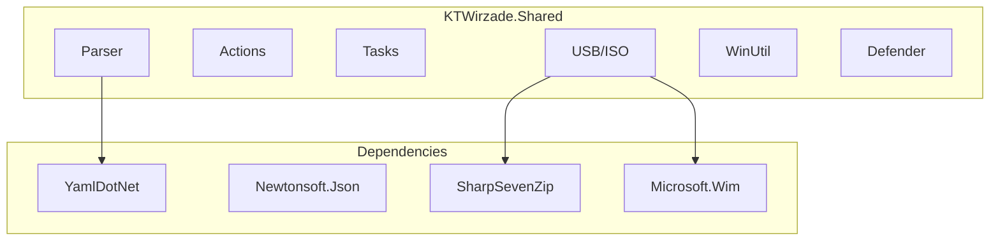

# Shared Library Overview

KTWirzade.Shared is the core engine used by both CLI and GUI.

## Architecture



## Key Classes

### AmeliorationUtil

Central orchestrator for playbook execution.

```csharp
public static class AmeliorationUtil
{
    public static Playbook Playbook { get; set; }
    public static bool UseKernelDriver;
    
    public static Playbook DeserializePlaybook(string path);
    public static List<ITaskAction> ParseActions(...);
    public static async Task<bool> RunPlaybook(...);
}
```

### Playbook

Represents a playbook configuration.

```csharp
public class Playbook : XmlDeserializable
{
    public string Name { get; set; }
    public string Username { get; set; }
    public string Version { get; set; }
    public Guid? UniqueId { get; set; }
    public string ProductCode { get; set; }
    public FeaturePage[] FeaturePages { get; set; }
    public Requirement[] Requirements { get; set; }
    // ...
}
```

### PlaybookParser

YAML deserialization with custom tag mappings.

```csharp
public static class PlaybookParser
{
    public static IDeserializer Deserializer { get; }
}
```

## Namespaces

| Namespace | Purpose |
|-----------|---------|
| `KTWirzade.Shared` | Core classes, utilities |
| `KTWirzade.Shared.Actions` | All action implementations |
| `KTWirzade.Shared.Parser` | YAML/XML parsing |
| `KTWirzade.Shared.Tasks` | Task structures |
| `KTWirzade.Shared.USB` | USB/ISO operations |
| `KTWirzade.Shared.Exceptions` | Custom exceptions |

## Key Dependencies

| Package | Purpose |
|---------|---------|
| `YamlDotNet` | YAML parsing |
| `Newtonsoft.Json` | JSON serialization |
| `SharpSevenZip` | 7-Zip archive handling |
| `Microsoft.Wim` | WIM file operations |
| `Polly.Core` | Resilience/retry patterns |
| `Downloader` | File download management |
| `TaskScheduler` | Windows Task Scheduler |
| `System.Text.Json` | JSON (newer code) |

## Shared Projects

The library imports two shared projects:

### Core
- Win32 API interop
- Logging system (`Log`)
- Serialization utilities
- Process management (`Win32.ProcessEx`)

### Interprocess
- Named pipe communication
- `InterLink` class
- Level management
- Message serialization

---

> [!info] See Also
> - [[Shared/Actions]] - Action implementations
> - [[Shared/Parser]] - Parser details
> - [[Shared/Tasks]] - Task structures
