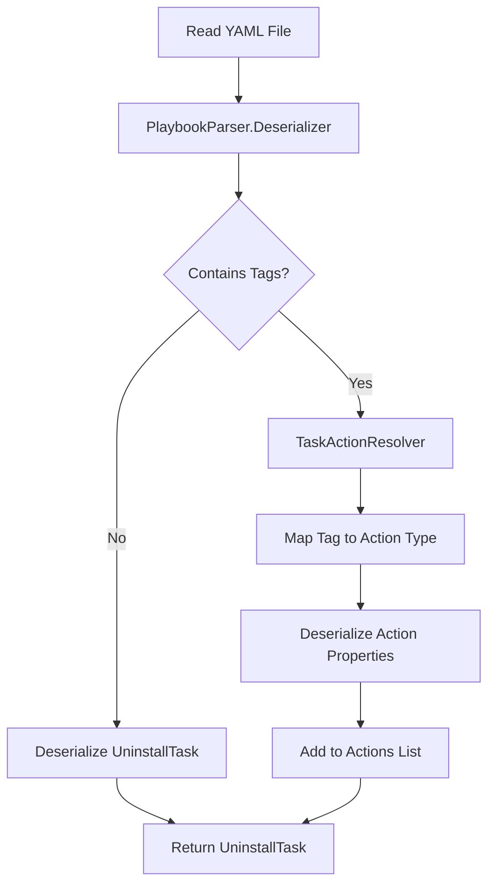

# Parser System

The parser converts YAML task files and XML configuration into executable objects.

## PlaybookParser

Located in `KTWirzade.Shared.Parser.PlaybookParser`.

### Deserializer Configuration

```csharp
public static IDeserializer Deserializer { get; } = new DeserializerBuilder()
    .WithNamingConvention(CamelCaseNamingConvention.Instance)
    .WithTagMapping("!task", typeof(TaskAction))
    .WithTagMapping("!file", typeof(FileAction))
    .WithTagMapping("!service", typeof(ServiceAction))
    .WithTagMapping("!registryKey", typeof(RegistryKeyAction))
    .WithTagMapping("!registryValue", typeof(RegistryValueAction))
    .WithTagMapping("!appx", typeof(AppxAction))
    .WithTagMapping("!systemPackage", typeof(SystemPackageAction))
    .WithTagMapping("!scheduledTask", typeof(ScheduledTaskAction))
    .WithTagMapping("!run", typeof(RunAction))
    .WithTagMapping("!powerShell", typeof(PowerShellAction))
    .WithTagMapping("!cmd", typeof(CmdAction))
    .WithTagMapping("!taskKill", typeof(TaskKillAction))
    .WithTagMapping("!software", typeof(SoftwareAction))
    .WithTagMapping("!download", typeof(DownloadAction))
    .WithTagMapping("!writeStatus", typeof(WriteStatusAction))
    .WithTagMapping("!status", typeof(WriteStatusAction))
    .WithNodeTypeResolver(new TaskActionResolver())
    .Build();
```

### YAML Tag Mappings

| YAML Tag | C# Type |
|----------|---------|
| `!task` | `TaskAction` |
| `!file` | `FileAction` |
| `!service` | `ServiceAction` |
| `!registryKey` | `RegistryKeyAction` |
| `!registryValue` | `RegistryValueAction` |
| `!appx` | `AppxAction` |
| `!systemPackage` | `SystemPackageAction` |
| `!scheduledTask` | `ScheduledTaskAction` |
| `!run` | `RunAction` |
| `!powerShell` | `PowerShellAction` |
| `!cmd` | `CmdAction` |
| `!taskKill` | `TaskKillAction` |
| `!software` | `SoftwareAction` |
| `!download` | `DownloadAction` |
| `!writeStatus` / `!status` | `WriteStatusAction` |

## TaskActionResolver

Resolves types at runtime based on YAML tags.

```csharp
internal class TaskActionResolver : INodeTypeResolver
{
    public bool Resolve(NodeEvent? nodeEvent, ref Type currentType)
    {
        if (!currentType.IsInterface || currentType != typeof(ITaskAction))
            return false;

        switch (nodeEvent?.Tag.Value)
        {
            case "!file:":
                currentType = typeof(FileAction);
                return true;
            case "!service:":
                currentType = typeof(ServiceAction);
                return true;
            // ... more cases
        }
    }
}
```

## XML Deserialization

Playbook configuration uses `XmlSerializer`:

```csharp
public static Playbook DeserializePlaybook(string path)
{
    var serializer = new XmlSerializer(typeof(Playbook));
    using var reader = new StreamReader(Path.Combine(path, "playbook.conf"));
    return (Playbook)serializer.Deserialize(reader);
}
```

## Parsing Flow



## Usage Example

```csharp
var configData = File.ReadAllText(Path.Combine(configPath, "main.yml"));
var task = PlaybookParser.Deserializer.Deserialize<UninstallTask>(configData);

foreach (TaskAction taskAction in task.Actions)
{
    if (taskAction is ITaskAction action)
    {
        await action.RunTask(output);
    }
}
```

---

> [!info] See Also
> - [[Shared/Actions]] - Action implementations
> - [[Playbooks/YAML-Tasks]] - YAML syntax
