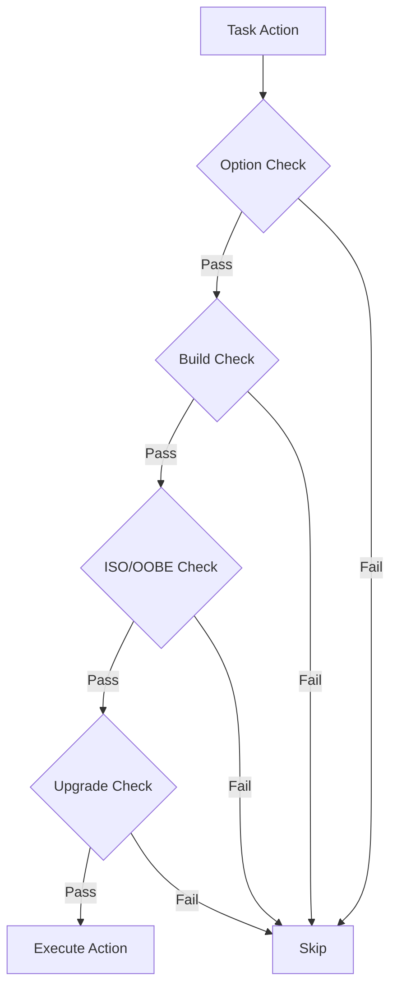
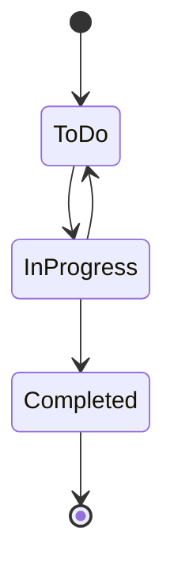

# Task System

The task system structures playbook execution.

## UninstallTask

Represents a group of actions with conditions.

```csharp
public class UninstallTask
{
    public string Title { get; set; }
    public string Description { get; set; }
    public ISOSetting ISO { get; set; }
    public OOBESetting? OOBE { get; set; }
    public List<ITaskAction> Actions { get; set; }
    public int Priority { get; set; }
    public UninstallTaskPrivilege Privilege { get; set; }
    public string Option { get; set; }
    public string[] Options { get; set; }
    public string[] Builds { get; set; }
    public string Arch { get; set; }
    public bool? OnUpgrade { get; set; }
    public string[] OnUpgradeVersions { get; set; }
    public string PreviousOption { get; set; }
    public List<string> Features { get; set; }
}
```

### YAML Representation

```yaml
- title: "Task Group"
  description: "What this does"
  option: "privacy"
  builds: "19041,19042"
  iso: false
  oobe: null
  actions:
    - !service
      operation: disable
      name: "DiagTrack"
```

## TaskAction (Actions)

Base class for all executable actions.

```csharp
public abstract class TaskAction
{
    public ISOSetting ISO { get; set; }
    public OOBESetting? OOBE { get; set; }
    public bool IgnoreErrors { get; set; }
    public string Option { get; set; }
    public string Status { get; set; }
    public string[] Options { get; set; }
    public string[] Builds { get; set; }
    public string Arch { get; set; }
    public bool? OnUpgrade { get; set; }
    public string[] OnUpgradeVersions { get; set; }
    public ErrorAction? ErrorAction { get; set; }
    public bool? AllowRetries { get; set; }
}
```

## Enums

### UninstallTaskStatus

```csharp
public enum UninstallTaskStatus
{
    ToDo,        // Not started
    InProgress,  // Currently executing
    Completed,   // Finished successfully
}
```

### UninstallTaskPrivilege

```csharp
public enum UninstallTaskPrivilege
{
    User,
    Admin,
    TrustedInstaller,
}
```

### ErrorAction

```csharp
public enum ErrorAction
{
    Ignore,   // Continue silently
    Log,      // Log error, continue
    Notify,   // Show notification, continue
    Halt,     // Stop execution
}
```

### ISOSetting

```csharp
public enum ISOSetting
{
    True,   // Run in both ISO and normal mode
    Only,   // Only run in ISO mode
    False,  // Never run in ISO mode (default)
}
```

### OOBESetting

```csharp
public enum OOBESetting
{
    True,   // Run in both OOBE and normal mode
    Only,   // Only run in OOBE mode
    False,  // Never run in OOBE mode
    Null,   // Default behavior
}
```

## Task Execution

### Condition Evaluation



### Status Flow



## Output System

```csharp
public class OutputProcessor
{
    public void WriteLineSafe(string level, string message);
    public void LogOptions { get; set; }
}
```

---

> [!info] See Also
> - [[Shared/Actions]] - Action implementations
> - [[Playbooks/YAML-Tasks]] - YAML syntax
