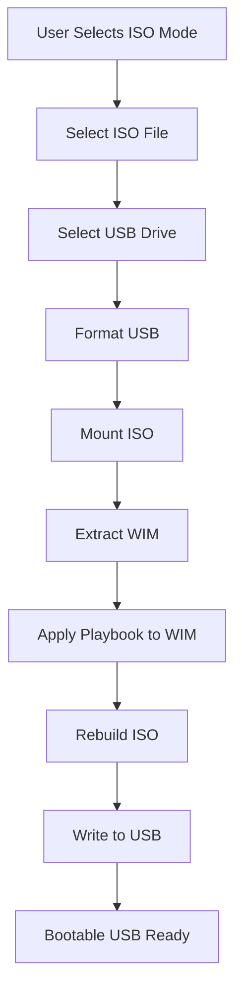

# USB and ISO Operations

The Shared library provides USB drive writing, ISO manipulation, and WIM file handling.

## Components

```
USB/
├── BZip2.cs          # BZip2 compression
├── Drive.cs          # Drive detection
├── Drivers.cs        # Driver management
├── Format.cs         # Drive formatting
├── InterMethods.cs   # Interop methods
├── Interop.cs        # Win32 interop
├── ISO.cs            # ISO operations
├── ISOWIM.cs         # ISO/WIM bridge
├── OSDownload.cs     # OS download
└── USB.cs            # USB operations
```

## USB Drive Operations

### Drive Detection

```csharp
// Detect available USB drives
var drives = Drive.GetAvailableDrives();
```

### Drive Formatting

```csharp
// Format drive for bootable media
Format.FormatDrive(driveLetter, "KT WIRZADE");
```

### Writing Bootable Media

```csharp
// Write ISO to USB
USB.WriteToUSB(isoPath, driveLetter, progressCallback);
```

## ISO Operations

### ISO Creation

```csharp
// Create ISO from files
ISO.CreateISO(sourceDir, outputPath);
```

### ISO Modification

```csharp
// Modify existing ISO
ISO.ModifyISO(isoPath, modifications);
```

## WIM File Handling

### WimWrapper

```csharp
public class WimWrapper
{
    public void DeleteFileOrFolder(string path);
    public void ApplyImage(string imageIndex);
    public void CaptureImage(string imagePath);
}
```

### ManagedWimLib

WIM file manipulation via wimlib native library:
- Image capture
- Image apply
- File deletion
- Directory operations

### Microsoft.Wim

Additional WIM operations via Microsoft's WIM API.

## ISO Mode Flow



## Supported Formats

| Format | Read | Write |
|--------|------|-------|
| ISO 9660 | Yes | Yes |
| UDF | Yes | Yes |
| WIM | Yes | Yes |
| ESD | Yes | No |

## Packages Used

| Package | Purpose |
|---------|---------|
| `DiscUtils.Iso9660` | ISO 9660 operations |
| `DiscUtils.Udf` | UDF filesystem |
| `DiscUtils.Wim` | WIM file operations |
| `Microsoft.Wim` | Windows WIM API |
| `ManagedWimLib` | wimlib wrapper |

---

> [!info] See Also
> - [[Shared/Overview]] - Shared library overview
> - [[Playbooks/Playbook-Conf]] - ISO configuration
